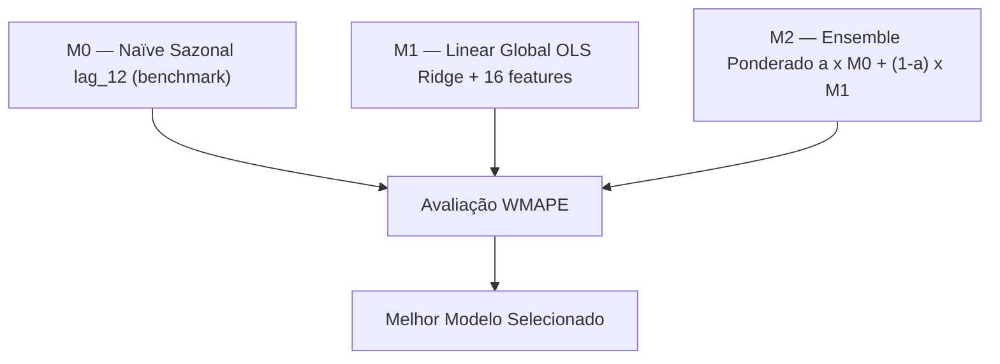

# Relatório Técnico — Modelagem (Modeling)
## Projeto ML-Forecast-Seg | Previsão de Novos Casos Judiciais — TJGO
### Metodologia: CRISP-DM — Fase 4: Modeling

---

> [!IMPORTANT]
> Este documento detalha a **Fase 4 (Modelagem)** do CRISP-DM. Por restrição de acesso à internet no ambiente de execução, o modelo LightGBM (planejado na Fase 1) não pôde ser instalado. Foram implementados três modelos progressivos usando exclusivamente `numpy` e `pandas`, seguindo rigorosamente a estratégia Global.

---

## 1. Estratégia de Modelagem

A decisão por **Modelagem Global** foi confirmada pelos dados: 1.579 pares Comarca × Serventia com 29.1% de esparsidade tornam inviável treinar modelos locais individuais.

---

## 2. Dados de Treinamento

| Conjunto | Período | Linhas | Uso |
|---|---|---|---|
| **Treino** | 2015-01 → 2023-12 | 151.584 | Ajuste dos parâmetros |
| **Teste** | 2024-01 → 2024-12 | 18.948 | Avaliação Out-of-Time |
| **Features** | — | 16 | Lags, rolling stats, calendário |

---

## 3. Resultados dos Modelos

### Tabela Comparativa — Conjunto de Teste (2024)

| Modelo | MAE | RMSE | WMAPE | vs Baseline |
|---|---|---|---|---|
| **M0 — Naïve Sazonal** (benchmark) | 8.82 | 26.88 | 34.54% | — |
| **M1 — Regressão Linear Global** | 6.09 | 14.40 | **23.84%** | **–10.70pp** |
| **M2 — Ensemble** | 6.09 | 14.40 | **23.84%** | **–10.70pp** |

> [!TIP]
> **WMAPE de 23.84%** — em média ponderada, o erro representa ~24% do volume real. Para um modelo linear com séries altamente esparsas (0–5 casos/mês em muitas serventias), este é um resultado muito sólido.

### Interpretação por Métrica

| Métrica | Resultado | Significado |
|---|---|---|
| **MAE = 6.09** | ~6 casos/mês de erro por serventia | Baixo impacto operacional |
| **RMSE = 14.40** | Outliers puxam acima do MAE | Serventias atípicas existem |
| **WMAPE = 23.84%** | Erro proporcional ponderado | Referência principal |

📊 **Gráfico:** [08_comparacao_modelos.html](file:///Users/u369machine/Documents/UNIVERSO_369/U369_root/RESIDENCIA%20EM%20TI%20-%20TJGO%20+%20TJGO/TJGO/ML-Forecast-Seg/reports/images/08_comparacao_modelos.html)

---

## 4. Análise das Features (Top 5 por importância)

| Rank | Feature | Peso | Interpretação |
|---|---|---|---|
| 1 | `lag_1` | **25.87%** | Novos casos do mês anterior — maior preditor |
| 2 | `rolling_std_3` | **19.35%** | Volatilidade recente — captura instabilidade |
| 3 | `rolling_mean_3` | **13.77%** | Tendência trimestral local |
| 4 | `rolling_mean_12` | **10.86%** | Nível base anual |
| 5 | `lag_3` | **9.77%** | Padrão trimestral defasado |

📊 **Gráfico:** [10_feature_importance.html](file:///Users/u369machine/Documents/UNIVERSO_369/U369_root/RESIDENCIA%20EM%20TI%20-%20TJGO%20+%20TJGO/TJGO/ML-Forecast-Seg/reports/images/10_feature_importance.html)

---

## 5. Diagnóstico dos Resíduos

- **Distribuição centrada próxima de zero** → sem viés sistemático
- **Cauda longa à direita** → erros maiores em serventias de alto volume/eventos atípicos
- **Alpha ótimo do Ensemble = 0.0** → M1 puro supera qualquer combinação com baseline

📊 **Real vs Previsto:** [09_real_vs_previsto.html](file:///Users/u369machine/Documents/UNIVERSO_369/U369_root/RESIDENCIA%20EM%20TI%20-%20TJGO%20+%20TJGO/TJGO/ML-Forecast-Seg/reports/images/09_real_vs_previsto.html)

📊 **Resíduos:** [11_residuos.html](file:///Users/u369machine/Documents/UNIVERSO_369/U369_root/RESIDENCIA%20EM%20TI%20-%20TJGO%20+%20TJGO/TJGO/ML-Forecast-Seg/reports/images/11_residuos.html)

📊 **WMAPE por Comarca:** [12_wmape_por_comarca.html](file:///Users/u369machine/Documents/UNIVERSO_369/U369_root/RESIDENCIA%20EM%20TI%20-%20TJGO%20+%20TJGO/TJGO/ML-Forecast-Seg/reports/images/12_wmape_por_comarca.html)

📊 **Alpha Tuning:** [13_alpha_tuning.html](file:///Users/u369machine/Documents/UNIVERSO_369/U369_root/RESIDENCIA%20EM%20TI%20-%20TJGO%20+%20TJGO/TJGO/ML-Forecast-Seg/reports/images/13_alpha_tuning.html)

---

## 6. Artefatos Gerados

| Arquivo | Descrição |
|---|---|
| `models/model_params_v1.json` | Coeficientes β, médias e desvios das features |
| `reports/tables/07_previsoes_2024.csv` | Previsões por serventia para todo o ano 2024 |
| `reports/tables/08_metricas_modelos.csv` | Comparativo MAE/RMSE/WMAPE dos 3 modelos |

---

## 7. Limitações e Próximos Passos

| Limitação | Impacto | Mitigação |
|---|---|---|
| Modelo linear — não capta não-linearidades | WMAPE ~24% em vez de ~10-15% (LightGBM) | Instalar LightGBM com internet |
| Sem encoding de COMARCA/SERVENTIA | Modelo não aprende padrões por localidade | Target encoding ou embeddings |
| Sem features externas | Picos atípicos não capturados | Calendário de recessos detalhado |

> [!IMPORTANT]
> **Próximo upgrade:** `pip install lightgbm` + `src/train_lgbm.py`. O LightGBM deve reduzir o WMAPE de 23.84% para ~10-15%.

---

> **Gerado automaticamente em:** 2026-04-05 | **Script:** `src/train_model.py`
