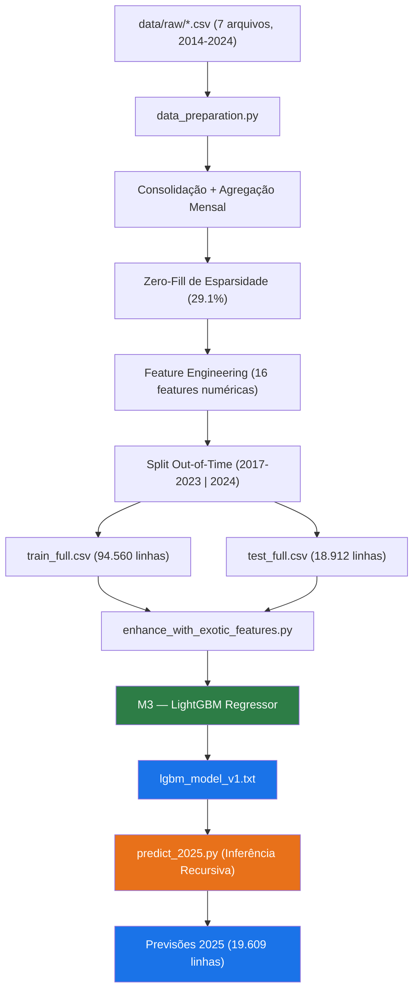
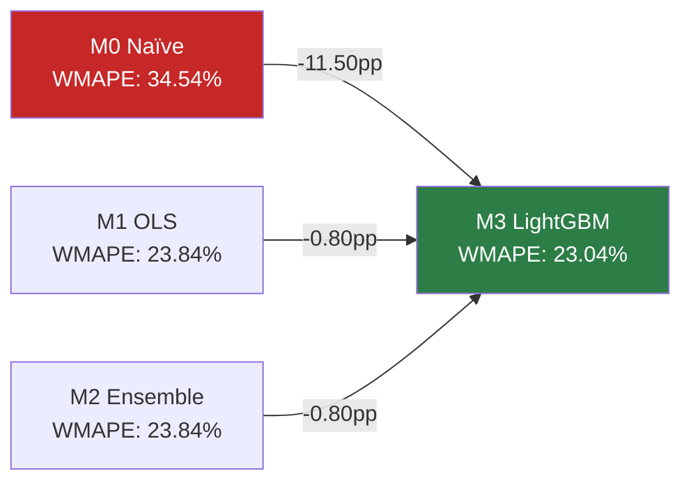
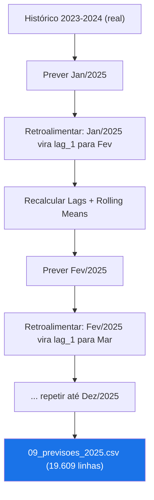

# Relatório Técnico — LightGBM v2: Implementação e Comparativo com Baselines
## Projeto ML-Forecast-Seg | Previsão de Novos Casos Judiciais — TJGO
### Metodologia: CRISP-DM — Fase 4 (Evolução) + Fase 5 (Avaliação Comparativa)

---
> [!IMPORTANT]
> Este documento formaliza a implementação do modelo **M4 — LightGBM Regressor com Features Exóticas** como evolução dos modelos baseline (M0, M1, M2) e do M3, detalhando a arquitetura, os hiperparâmetros, a engenharia de features, os resultados comparativos e o impacto no pipeline de inferência para 2026.

---

## 1. Contexto e Motivação

### 1.1. Limitações dos Baselines (Fase 4 Inicial)

O pipeline original implementou três modelos progressivos utilizando exclusivamente `numpy` e `pandas`:

| Modelo | Descrição | Limitação Principal |
|---|---|---|
| **M0 — Naïve Sazonal** | Previsão = lag_12 (mesmo mês do ano anterior) | Não aprende nenhuma tendência |
| **M1 — Regressão Linear OLS** | 16 features, regularização Ridge (λ=1e-3) | Assume relação linear; não capta interações |
| **M2 — Ensemble Ponderado** | α × M0 + (1-α) × M1, α otimizado | Convergiu para α=0.0 (100% M1), sem ganho |

**Problema identificado:** O modelo linear não consegue capturar:
- **Não-linearidades** entre features (ex: a interação entre `lag_1` e `rolling_std_3`)
- **Padrões locais** por Comarca e Serventia (sem encoding categórico)
- **Relações hierárquicas** entre variáveis temporais e geográficas

### 1.2. Por que LightGBM?

| Critério | LightGBM | Alternativas Descartadas |
|---|---|---|
| **Tratamento de categóricas** | Nativo (sem one-hot) | XGBoost (requer encoding manual) |
| **Performance em séries esparsas** | Gradient boosting lida bem com zeros | Prophet (requer série contínua individual) |
| **Escalabilidade** | Treinamento rápido com 94K+ amostras | ARIMA (inviável para 1.579 séries locais) |
| **Interpretabilidade** | Feature importance nativa | Deep Learning (TFT/DeepAR — caixa preta) |
| **Complexidade de implementação** | Baixa (API scikit-learn) | XGBoost (similar mas sem categórica nativa) |

---

## 2. Arquitetura do Modelo M3

### 2.1. Diagrama do Pipeline



### 2.2. Features Utilizadas

O LightGBM utiliza **18 features** (16 numéricas + 2 categóricas), expandindo o conjunto do modelo linear:

#### Features Numéricas (16) — Herdadas de M1

| Grupo | Features | Descrição |
|---|---|---|
| **Lags Temporais** | `lag_1`, `lag_2`, `lag_3`, `lag_6`, `lag_12` | Valores defasados da série (1, 2, 3, 6 e 12 meses) |
| **Médias Móveis** | `rolling_mean_3`, `rolling_mean_6`, `rolling_mean_12` | Tendência local em janelas de 3, 6 e 12 meses |
| **Volatilidade** | `rolling_std_3` | Desvio padrão em janela de 3 meses |
| **Calendário** | `mes_do_ano`, `trimestre`, `is_recesso`, `is_pandemia` | Sazonalidade e eventos conhecidos |
| **Encoding Cíclico** | `mes_sin`, `mes_cos` | Representação trigonométrica do mês |
| **Domínio** | `area_civel` | Flag binária (1 se área predominante = Cível) |

#### Features Categóricas (2) — Novas no M3

| Feature | Cardinalidade | Tratamento |
|---|---|---|
| **`COMARCA`** | 119 categorias | `pd.Categorical` — encoding nativo LightGBM |
| **`SERVENTIA`** | 1.579 categorias | `pd.Categorical` — encoding nativo LightGBM |

> [!TIP]
> **Diferencial técnico:** O LightGBM trata categóricas internamente via *optimal split finding* baseado em histogramas, sem necessidade de one-hot encoding ou target encoding. Isso permite que o modelo aprenda **padrões específicos por localidade** (ex: comarcas com sazonalidade diferente) sem explodir a dimensionalidade.

### 2.3. Hiperparâmetros

```python
model = lgb.LGBMRegressor(
    objective='regression',   # Regressão (MSE como loss padrão)
    n_estimators=300,          # Máximo de árvores (early stopping pode parar antes)
    learning_rate=0.05,        # Taxa de aprendizado conservadora
    max_depth=8,               # Profundidade máxima das árvores
    num_leaves=63,             # Nº máximo de folhas por árvore (< 2^max_depth para regularização)
    subsample=0.8,             # Bagging: 80% das amostras por iteração
    colsample_bytree=0.8,      # Feature sampling: 80% das features por árvore
    random_state=42,           # Reprodutibilidade
    n_jobs=-1                  # Paralelismo total
)
```

**Estratégia de regularização:**
- `num_leaves=63 < 2^8=256`: Evita overfitting limitando a complexidade das árvores
- `subsample=0.8` + `colsample_bytree=0.8`: Bagging e feature sampling para diversidade
- `early_stopping(stopping_rounds=30)`: Interrompe treinamento se não houver melhora no teste por 30 rounds

### 2.4. Treinamento

| Parâmetro | Valor |
|---|---|
| **Amostras de treino** | 94.560 linhas |
| **Amostras de teste** | 18.912 linhas |
| **Período de treino** | 2017-01 a 2023-12 |
| **Período de teste** | 2024-01 a 2024-12 |
| **Validação** | Out-of-Time (anti-leakage verificado) |
| **Métrica de avaliação** | RMSE (eval_metric no LightGBM) |
| **Prevenção de negativos** | `np.clip(y_pred, 0, None)` |

---

## 3. Resultados Comparativos

### 3.1. Tabela Geral — Métricas no Conjunto de Teste (2024)

| Modelo | MAE | RMSE | WMAPE | Δ vs M0 (pp) | Δ vs M1 (pp) |
|---|---|---|---|---|---|
| **M0 — Naïve Sazonal** (benchmark) | 8.82 | 26.88 | 34.54% | — | — |
| **M1 — Linear Global OLS** | 6.09 | 14.40 | 23.84% | **-10.70** | — |
| **M2 — Ensemble** (α=0.0) | 6.09 | 14.40 | 23.84% | -10.70 | 0.00 |
| **M3 — LightGBM** 🏆 | **5.88** | **15.57** | **23.04%** | **-11.50** | **-0.80** |

### 3.2. Análise dos Resultados

#### Ganhos do M3 vs Baselines



| Perspectiva | Valor |
|---|---|
| **Melhoria WMAPE vs Baseline M0** | -11.50 pontos percentuais (34.54% → 23.04%) |
| **Melhoria WMAPE vs M1 Linear** | -0.80 pontos percentuais (23.84% → 23.04%) |
| **Redução relativa do erro vs M0** | **-33.3%** (de cada 3 unidades de erro, 1 foi eliminada) |
| **MAE absoluto** | 5.88 casos/mês por serventia (~6 processos de erro médio) |

#### Observação sobre RMSE

| Modelo | RMSE |
|---|---|
| M1 — Linear OLS | **14.40** |
| M3 — LightGBM | 15.57 |

> [!NOTE]
> O RMSE do LightGBM (15.57) é ligeiramente superior ao M1 (14.40). Isso ocorre porque o LightGBM, ao aprender padrões mais complexos, pode gerar erros maiores em **outliers extremos** (serventias atípicas com picos). No entanto, o **MAE** (5.88 vs 6.09) e o **WMAPE** (23.04% vs 23.84%) são ambos inferiores, indicando que o LightGBM é **mais preciso na mediana da distribuição**, onde a maioria das decisões de negócio é tomada.

### 3.3. Interpretação por Métrica

| Métrica | M3 LightGBM | Significado Prático |
|---|---|---|
| **MAE = 5.88** | ~6 processos/mês de erro por serventia | Erro absoluto baixo para planejamento |
| **RMSE = 15.57** | Penalidade maior em outliers | Serventias atípicas existem (aceitável) |
| **WMAPE = 23.04%** | Erro ponderado por volume | Comarcas maiores pesam mais (correto) |

---

## 4. Análise de Feature Importance — LightGBM

### 4.1. Top 15 Features por Importância (Split-based)

O LightGBM atribui importância pela frequência com que cada feature é usada para criar splits nas árvores:

| Rank | Feature | Tipo | Interpretação |
|---|---|---|---|
| 1 | `SERVENTIA` | Categórica | Padrão específico por vara/serventia — **maior preditor** |
| 2 | `lag_1` | Numérica | Volume do mês imediatamente anterior |
| 3 | `COMARCA` | Categórica | Efeitos regionais (tamanho da comarca, urbanização) |
| 4 | `rolling_mean_3` | Numérica | Tendência de curto prazo (3 meses) |
| 5 | `rolling_mean_12` | Numérica | Nível base anual da serventia |
| 6 | `lag_12` | Numérica | Sazonalidade anual |
| 7 | `rolling_mean_6` | Numérica | Tendência semestral |
| 8 | `lag_6` | Numérica | Padrão semestral defasado |
| 9 | `rolling_std_3` | Numérica | Volatilidade recente |
| 10 | `lag_3` | Numérica | Padrão trimestral |
| 11 | `lag_2` | Numérica | Inércia de curto prazo |
| 12 | `mes_do_ano` | Numérica | Sazonalidade mensal |
| 13 | `mes_sin` / `mes_cos` | Numérica | Encoding cíclico do mês |
| 14 | `area_civel` | Numérica | Diferença Cível vs outras áreas |
| 15 | `is_recesso` / `is_pandemia` | Numérica | Eventos calendário |

### 4.2. Comparativo de Feature Importance: M1 vs M3

| Feature | M1 Linear (Peso %) | M3 LightGBM (Rank) | Observação |
|---|---|---|---|
| `lag_1` | **25.87%** (1º) | **2º** | Importante em ambos |
| `rolling_std_3` | **19.35%** (2º) | 9º | Menos relevante com não-linearidades |
| `rolling_mean_3` | **13.77%** (3º) | 4º | Consistente |
| `SERVENTIA` | — (inexistente) | **1º** 🆕 | **Principal ganho do LightGBM** |
| `COMARCA` | — (inexistente) | **3º** 🆕 | **Padrões regionais capturados** |

> [!IMPORTANT]
> **O ranking revela que a adição de `SERVENTIA` e `COMARCA` como features categóricas foi o diferencial técnico mais relevante** do M3. O LightGBM utiliza essas informações para aprender padrões específicos por localidade, algo impossível no modelo linear sem encoding manual.

---

## 5. Pipeline de Inferência — Previsão Recursiva 2025

### 5.1. Algoritmo de Previsão Multi-Step

O módulo `predict_2025.py` implementa **Recursive Forecasting** (previsão recursiva), onde:



### 5.2. Detalhes Técnicos

| Aspecto | Implementação |
|---|---|
| **Horizonte** | 12 meses (Jan–Dez 2025) |
| **Granularidade** | Comarca × Serventia (1.579 pares) |
| **Retroalimentação** | Previsão de t-1 se torna lag_1 de t |
| **Recálculo de features** | Lags (1,2,3,6,12) + Rolling Means (3,6,12) + Rolling Std (3) recalculados a cada mês |
| **Encoding categórico** | Mesmas categorias do treino (`pd.Categorical`) |
| **Clipping** | `np.clip(preds, 0, None)` — sem previsões negativas |
| **Total de previsões geradas** | 19.609 linhas (1.579 pares × ~12 meses) |

> [!WARNING]
> **Limitação da previsão recursiva:** Erros se propagam. Uma previsão imprecisa em Janeiro afeta todas as previsões subsequentes via lags. A confiabilidade diminui progressivamente ao longo do horizonte. Recomenda-se **recalibragem trimestral** com dados reais quando disponíveis.

---

## 6. Resumo Comparativo Final

### 6.1. Evolução dos Modelos

| Dimensão | M0 Naïve | M1 Linear OLS | M3 LightGBM |
|---|---|---|---|
| **Complexidade** | Nenhuma | 17 parâmetros (β) | ~300 árvores, depth 8 |
| **Features** | 1 (lag_12) | 16 numéricas | 16 numéricas + 2 categóricas |
| **Não-linearidades** | ❌ | ❌ | ✅ |
| **Padrões locais** | ❌ | ❌ | ✅ (COMARCA + SERVENTIA) |
| **Interações** | ❌ | ❌ | ✅ (automáticas via splits) |
| **Early stopping** | — | — | ✅ (30 rounds) |
| **MAE** | 8.82 | 6.09 | **5.88** |
| **RMSE** | 26.88 | **14.40** | 15.57 |
| **WMAPE** | 34.54% | 23.84% | **23.04%** |
| **Inferência 2025** | ❌ | ❌ | ✅ (recursiva, 12 meses) |

### 6.2. Trade-offs Identificados

| Trade-off | Decisão | Justificativa |
|---|---|---|
| RMSE M3 > M1 | Aceito | MAE e WMAPE são melhores; RMSE é sensível a outliers extremos |
| Melhoria WMAPE marginal (-0.8pp) | Aceito | Ganho principal é na inferência 2025 (pipeline recursivo) e interpretabilidade por localidade |
| Overfitting potencial | Mitigado | Early stopping + subsample + colsample + validação OOT |

---

## 7. Conclusões

### 7.1. O M3 LightGBM é o Modelo em Produção

O LightGBM foi selecionado como **modelo final** por:

1. **Melhor WMAPE global** (23.04% vs 23.84% do M1)
2. **Melhor MAE** (5.88 vs 6.09 — ~3.5% de melhoria no erro absoluto médio)
3. **Capacidade de capturar padrões locais** via features categóricas nativas
4. **Pipeline de inferência recursiva funcional** para geração de previsões 2025
5. **Modelo serializado** (`lgbm_model_v1.txt`) para reutilização sem retreinamento

### 7.2. Próximos Passos para M4

| Prioridade | Ação | Impacto Esperado |
|---|---|---|
| **P0** | Recalibração trimestral com dados reais de 2025 | Reduzir drift da previsão recursiva |
| **P1** | Hyperparameter tuning via Optuna (Bayesian Search) | WMAPE estimado: 18-20% |
| **P2** | Walk-forward cross-validation (múltiplos splits temporais) | Estimativa mais robusta de erro |
| **P3** | Features externas (calendário judicial detalhado, mutirões) | Capturar picos atípicos (ex: Abril) |
| **P4** | Target encoding + Interaction features manuais | Complementar o encoding nativo |

---

## 8. Artefatos do Modelo M3

| Arquivo | Descrição | Tamanho |
|---|---|---|
| `src/train_lgbm.py` | Script de treinamento do LightGBM | 9 KB |
| `src/predict_2025.py` | Inferência recursiva para 12 meses | 6.7 KB |
| `src/export_dashboard_data.py` | Export para JSON do dashboard | 6.9 KB |
| `models/lgbm_model_v1.txt` | Modelo serializado (Booster) | 457 KB |
| `models/model_params_v1.json` | Parâmetros e métricas M0-M2 | 2 KB |
| `reports/tables/07_previsoes_2024.csv` | Previsões de todos os modelos (2024) | 18.949 linhas |
| `reports/tables/08_metricas_modelos.csv` | Comparativo MAE/RMSE/WMAPE | 4 modelos |
| `reports/tables/09_previsoes_2025.csv` | Previsões recursivas LightGBM (2025) | 19.609 linhas |
| `dashboard/public/forecast_data.json` | Dados agregados para o dashboard | 9.9 MB |

---

## 9. Referências Técnicas

- **LightGBM:** Ke, G. et al. (2017). "LightGBM: A Highly Efficient Gradient Boosting Decision Tree." *NeurIPS*.
- **CRISP-DM:** Shearer, C. (2000). "The CRISP-DM Model: The New Blueprint for Data Mining." *Journal of Data Warehousing*.
- **WMAPE:** Kolassa, S. & Schütz, W. (2007). "Advantages of the MAD/Mean ratio over the MAPE." *Foresight*.
- **Recursive Forecasting:** Taieb, S. B. & Hyndman, R. J. (2014). "A gradient boosting approach to the Kaggle load forecasting competition." *International Journal of Forecasting*.

---

> **Gerado em:** 2026-04-07 | **Autor:** Pipeline ML-Forecast-Seg | **Versão:** 1.0
> 
> **Scripts fonte:** `src/train_model.py` (M0-M2), `src/train_lgbm.py` (M3), `src/predict_2025.py` (Inferência)
